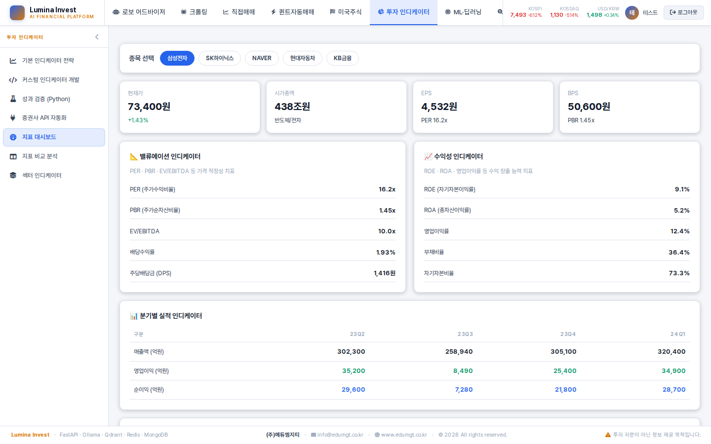
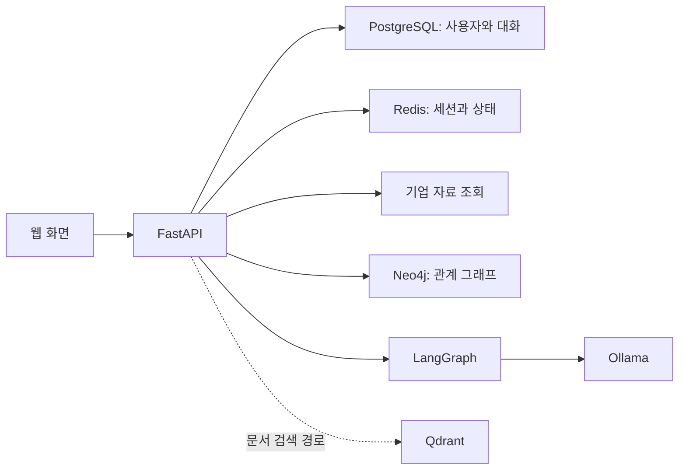

# Lumina Invest

기업 지표 조회와 AI 채팅을 출발점으로 발전시키는 **투자 리서치 포트폴리오**입니다.

**현재 단계: 초기 개발 · 로컬 기본 동작 확인**

[edumgt/lumina-invest](https://github.com/edumgt/lumina-invest)의 교육용 코드에서 출발했습니다. 원본 기반을 유지하면서 자료 확인, AI의 설명, 사용자의 판단 기록을 연결하는 경험을 개발합니다.

## 프로젝트가 다루는 일

상장기업을 조사할 때 기업 지표와 관련 자료를 확인하고, AI의 설명을 검토하며, 자신의 판단을 기록할 수 있는 흐름을 목표로 합니다.

현재 확인한 두 경로는 다음과 같습니다.

- **기업 조회:** 종목 검색 → 기업 선택 → 지표 확인
- **AI 채팅:** 질문 입력 → 답변 표시 → 대화 이력 저장

선택한 기업 자료와 AI의 출처 링크, 판단 노트를 연결하는 기능은 다음 개발 범위입니다.

## 원본 기반과 개인 작업

| 구분 | 범위 | 상태 |
|---|---|---|
| 원본 제공 기반 | 인증, 기업 조회, AI 에이전트·RAG 경로, 그래프, 모의투자·퀀트 기능 및 관련 자료 | edumgt의 기존 코드. 전체 기능의 실행 검증은 미수행 |
| 개인 작업 — 저장소 | 독립 개인 저장소에서 개발하며 원작 출처와 기존 이력 유지 | 개인 개발 저장소 |
| 개인 작업 — 실행 환경 | 독립 Compose 환경, 전용 포트·볼륨, 시작 시장 동기화 가드와 최소 검사 | [PR #2로 main 반영](https://github.com/Noah-TaeHwan/lumina-invest/pull/2) |
| 개인 작업 — 소개 | 제품 중심 README, 원본 교육 자료 보존, 로컬 재현 절차 가이드(새 clone 실행은 미확인) | [PR #2로 main 반영](https://github.com/Noah-TaeHwan/lumina-invest/pull/2), 교차 검수 후 문구 보완 |
| 개인 작업 — 확인 | 회원가입·로그인, 종목 조회·지표 표시, 시드 그래프, 채팅 응답·저장 | 2026-10-01 로컬 확인 |
| 다음 개발 | 영속 관심종목, 자료 출처·시점, AI 근거 링크, 기업별 판단 노트 | 계획 |

기능을 추가할 때 이 표에 개인 변경과 확인 근거를 함께 갱신합니다.

## 화면

아래는 원본 프로젝트에 포함된 기업 화면 예시입니다. **API Mock 기반 캡처**이며, 현재 로컬 실데이터·AI 정확성·공개 배포를 검증한 이미지로 사용하지 않습니다.

실제 대표 화면은 해외 종목의 통화 표시 문제를 해결한 뒤 새로 준비합니다.

## 현재 구성

| 역할 | 사용 기술 |
|---|---|
| API | Python 3.12 · FastAPI |
| AI 워크플로 | LangGraph · Ollama 기반 로컬 모델 |
| 사용자·대화 데이터 | PostgreSQL · SQLAlchemy |
| 세션·상태 | Redis |
| 기업 관계 그래프 | Neo4j |
| 문서 검색 경로 | Qdrant · Ollama 임베딩 |
| 웹 화면 | Vanilla JavaScript ES Modules |
| 로컬 실행 | Docker Compose |

위 구성은 현재 코드와 로컬 실행 경로를 설명합니다. Qdrant 검색을 통한 출처 연결 답변은 아직 확인하지 않았습니다.

코드 진입점은 [FastAPI 앱](app/main.py)이며, [채팅 API](app/routes/chat.py)가 [LangGraph 에이전트](app/services/langgraph_agent.py)와 PostgreSQL 대화 저장을 연결합니다.

## 로컬에서 실행하기

Docker Compose v2와 이미지·모델 다운로드가 가능한 네트워크가 필요합니다. 별도의 유료 AI API 키는 사용하지 않습니다.

- 실행 설정: [compose.portfolio.yml](compose.portfolio.yml)
- 앱 주소: `http://127.0.0.1:8967`
- 로컬 채팅 모델: `llama3.2:1b` · 임베딩 모델: `nomic-embed-text`
- 비공개 설정: `.env.portfolio` — 별도 생성, Git과 이미지 빌드에서 제외
- 시작 시장 동기화 비활성화, 실주문 키·Celery/ingest 서비스·Docker socket 제외

[로컬 실행 가이드](PORTFOLIO_LOCAL.md)에서 checkout, 비밀값 생성, 모델 준비, 기동과 기능 확인 순서를 안내합니다.
기본은 main clone이며, 병합 전 리뷰에는 해당 PR의 head 브랜치를 사용합니다.

기본 [docker-compose.yml](docker-compose.yml)은 8966 포트와 백그라운드 ingest/Celery 구성이 포함된 원본 실행 경로입니다.
이 포트폴리오용 profile과 서비스·주소를 혼용하지 않습니다.

## 확인한 동작과 한계

2026-10-01 별도 로컬 브랜치에서 확인했습니다.

| 항목 | 결과 |
|---|---|
| 회원가입·로그인 | 확인 |
| 종목 검색·기업 지표 표시 | 확인. 일부 재무 필드는 누락 |
| 삼성전자 시드 관계 그래프 | 확인 |
| AI 채팅·화면 표시·대화 저장 | 확인. 한 화면 요청은 약 419.9초 소요 |
| 시작 시장 동기화 비활성 설정 | 최소 검사 및 실제 서버 상태 확인 |
| 해외 기업 통화·금액 표시 | 오류 발견, 수정 예정 |
| RAG 출처 연결·citations 표시 | 현재 확인한 답변에서 근거 링크를 제공하지 못함 |
| AI 근거 링크·판단 노트 | 개발 예정 |
| 공개 데모·배포·개인 CI 성공 | 미확인 |

419.9초는 단일 로컬 요청의 관측값이며 평균 응답 시간·서비스 성능 지표가 아닙니다. 채팅 연결 확인은 금융 답변 정확성이나 투자 성과 검증을 의미하지 않습니다.

원본 테스트 파일과 GitHub workflow가 있습니다. 2026-10-01 조사에서 개인 저장소 Actions는 `enabled=false`, 실행 기록은 0건이었습니다. 전체 CI와 공개 배포는 확인하지 않았습니다.
시작 동기화 가드의 [최소 검사](tests/test_startup_data_sync.py)는 PR #2로 반영했습니다. 실행 절차는 로컬 가이드에 설명합니다.

## 다음 개발

- [ ] 해외 기업 통화·단위 표시 개선
- [ ] AI 응답 지연 원인 개선 및 실제 사용자 요청으로 확인
- [ ] 기업 자료의 출처·조회 시각 표시
- [ ] 관심종목과 기업별 판단 노트 저장
- [ ] AI 답변에 근거 링크 전달·표시
- [ ] 위 기능을 연결한 대표 리서치 흐름과 검증 근거 준비

## 상세 자료

- [로컬 실행 가이드](PORTFOLIO_LOCAL.md)
- [원본 교육 자료·Mock 화면·개념 설명 보존본](docs/upstream/readme.md)
- [AWS 목표 설계](aws.md) · [온프레미스 목표 설계](onprem.md) · [데이터 파이프라인 목표 설계](pipeline.md)

목표 설계와 교육 자료는 원본 프로젝트에서 제공한 문서이며 개인 운영·배포 완료를 증명하지 않습니다.
기존 904줄 README의 내용은 출처와 기준 commit을 붙여 보존했습니다. 상대 링크·코드 블록 경계·줄 끝 공백 표현을 교정했으며, 의도된 줄바꿈은 유지했습니다.

## 원작 출처와 이용 조건

- 원본 코드·기초 자료: [edumgt/lumina-invest](https://github.com/edumgt/lumina-invest)
- 개인 개발 저장소: [Noah-TaeHwan/lumina-invest](https://github.com/Noah-TaeHwan/lumina-invest)
- 개인 포트폴리오 공개는 강사님의 허용 범위에서 진행합니다.
- 개인 포트폴리오 공개 허용이 프로젝트 전체의 일반 재배포 라이선스나 MIT 재선언을 뜻하지는 않습니다. 명시적인 프로젝트 라이선스는 확인하지 않았습니다.

이 프로젝트는 학습·정보 제공을 위한 포트폴리오입니다. 투자 자문이나 수익 보장을 제공하지 않습니다.
