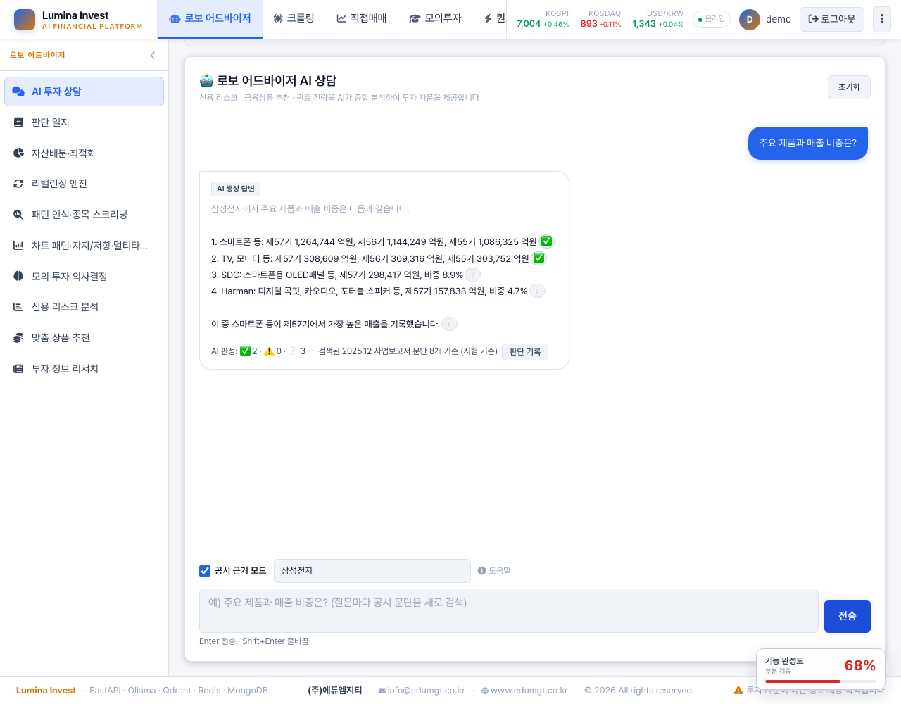
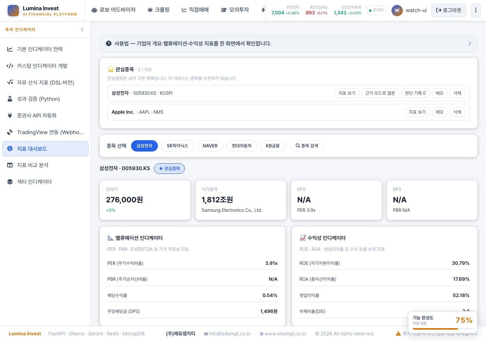
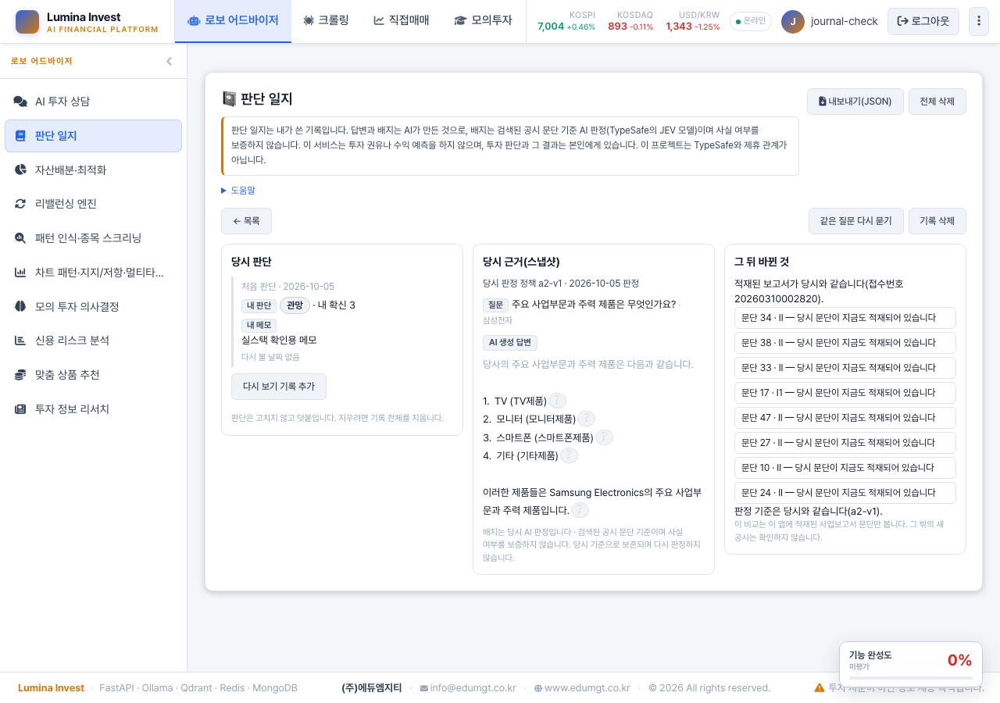
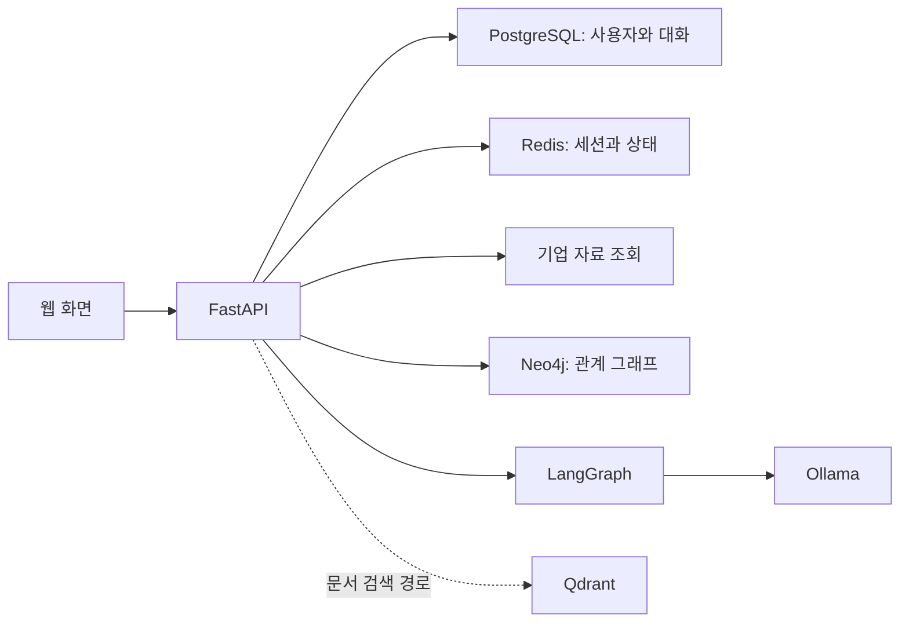

# Lumina Invest

기업 지표 조회와 AI 채팅을 출발점으로 발전시키는 **투자 리서치 포트폴리오**입니다.

**현재 단계: 초기 개발 · 로컬 기본 동작 확인 · JEV 실험 완료(가격 판단: 판정력 없음 / 공시 근거 판정: 판정력 확인, 최고 기준선과 실용적 동등 → 채팅 연결(A-2) → 주체 확인 실험(A-3) 관문 미통과 → JEV 주체 질문(A-4) 탐색 진행 기준 미통과) · 판단 일지 로컬 종단 확인**

[edumgt/lumina-invest](https://github.com/edumgt/lumina-invest)의 공개 원본 코드에서 출발했습니다. 원본 기반을 유지하면서 자료 확인, AI의 설명, 사용자의 판단 기록을 연결하는 경험을 개발합니다.

## 한눈에 보기

**AI 답변을 그대로 믿지 않고, 문장마다 공시 근거를 붙입니다.** 위 화면은 로컬 실스택(삼성전자 2025.12 사업보고서 문단, 생성 모델 `llama3.1:8b`, 판정 TypeSafe JEV)에서 실제로 받은 답변입니다. 공시 문단으로 확인된 숫자 두 문장은 ✅, 검색된 문단으로 확인할 수 없는 세 문장은 ❔입니다.

| 흐름 | 하는 일 | 상태 |
|---|---|---|
| 관심종목 | 종목을 서버에 저장하고 국내 상장사는 DART 고유번호로 자동 연결 | 기본 기능 |
| 기업 자료 | 지표마다 출처(Yahoo Finance)·조회 시각·분기 끝 날짜, 종목 통화별 단위 | 기본 기능 |
| AI 설명과 근거 | 답변 문장마다 ✅·⚠️·❔ 배지와 근거 공시 문단 | 기능 플래그 `EVIDENCE_CHAT_ENABLED` |
| 내 판단 노트 | 판정 한 건에서 판단·확신·메모를 기록하고 당시 근거를 스냅샷으로 보존 | 기능 플래그 `JOURNAL_ENABLED` |
| 재방문 | 다시 볼 날짜가 된 기록, 그 뒤 공시가 바뀌었는지 비교 | 판단 일지 안 |

**JEV로 확인한 것과 안 된 것(사전등록 실험).** 가격 판단(분봉 돌파 실패 예측)에는 판정력이 없었고(홀드아웃 AUC 0.513), 공시 근거 판정에는 판정력이 있어 제품에 넣었습니다(최고 기준선과 실용적 동등). 주어가 바뀐 문장(다른 부문·제품 이름)을 거르는 개선 시도 두 번(A-3·A-4)은 미리 정한 기준을 넘지 못해 기본 정책으로 바꾸지 않았습니다. 정답은 AI 참조 라벨이며 사람 감사는 하지 않았습니다. 판정에는 TypeSafe의 JEV 모델을 썼고, 이 프로젝트는 TypeSafe와 제휴 관계가 아닙니다. 투자 권유가 아닙니다.

이 절은 AI(Claude Code)가 작성했습니다. 자세한 설계·결과는 아래 각 절과 링크한 리포트에 있습니다.

이 화면을 직접 띄우는 방법(기능 플래그·TypeSafe JEV 키·공시 문단 적재)은 [로컬 실행 가이드 7절](PORTFOLIO_LOCAL.md#7-공시-근거-모드판단-일지-켜기)에 있습니다.

## 프로젝트가 다루는 일

상장기업을 조사할 때 기업 지표와 관련 자료를 확인하고, AI의 설명을 검토하며, 자신의 판단을 기록할 수 있는 흐름을 목표로 합니다.

현재 확인한 경로는 다음과 같습니다.

- **기업 조회:** 종목 검색 → 기업 선택 → 지표 확인
- **AI 채팅:** 질문 입력 → 답변 표시 → 대화 이력 저장
- **공시 근거 모드**(기능 플래그 `EVIDENCE_CHAT_ENABLED`, 기본 꺼짐): 회사 선택 → 질문 → 답변 문장마다 ✅·⚠️·❔ 배지와 근거 공시 문단
- **판단 일지**(기능 플래그 `JOURNAL_ENABLED`, 기본 꺼짐): 끝난 판정 한 건에서 판단 기록(관망·매수 검토·제외, 내 확신, 메모, 다시 볼 날짜) → 당시 답변·배지·근거 문단을 스냅샷으로 보존 → 다시 볼 때 지금 적재된 공시 문단과 비교(같음·사라짐·보고서 바뀜·확인 불가) → JSON 내보내기·삭제

판단 일지는 JEV를 새로 부르지 않고 당시 AI 판정을 그대로 보여 주기만 합니다. 가격·수익률·적중률은 붙이지 않으며 투자 권유가 아닙니다. 원 대화를 지워도 기록은 남고, 메모는 외부 모델·알림·감사 로그로 나가지 않습니다. 로컬 실스택에서 질문 → 기록 → 스레드 삭제 → 기록 재열기 → 내보내기 → 전체 삭제 한 바퀴를 확인했습니다([설계](docs/superpowers/specs/2026-10-04-judgment-journal-c-design.md)). 이 단락은 AI가 작성했습니다.

## JEV Gate Lab — 사전등록 판정력 실험

TypeSafe의 판단 모델 JEV(`jev-1.13.0`)를 매매 진입 판단에 붙였을 때 실제로 도움이 되는지 검증한 실험입니다. 앱과 분리된 `lab/jev_gate/` 패키지에 있습니다.

**질문:** BTCUSDT 5분봉 Donchian 돌파(240분 채널)의 진입 신호마다, JEV가 "이 돌파가 실패할 확률"을 답하게 했을 때 실제로 실패할 거래를 가려내는가?

**설계**

- 데이터: Binance 공개 아카이브 1분봉 1년치(2025-10~2026-09), 파일마다 체크섬 검증
- JEV 입력: 종목명·날짜·가격을 뺀 익명 특징 11개(수익률·변동성 비율·거래량 z-score 등)
- 라벨: 다음 봉 시가 진입, 코드가 정한 손절·익절·2시간 시간청산으로 낸 비용 차감 손실 여부
- 비교: 무작위(0.5)와, 같은 특징으로 개발 구간에서 학습한 로지스틱 회귀
- 사전등록: 구간·규칙·질문 해시·판단 기준을 [prereg.json](lab/jev_gate/prereg.json)에 먼저 고정하고, 홀드아웃은 [동결 파일](lab/jev_gate/prereg_holdout.json)을 커밋한 뒤 한 번만 열었습니다

**결과(홀드아웃 476건)**

| 모델 | AUC | 일 단위 블록 부트스트랩 95% 구간 |
|---|---:|---|
| JEV | 0.513 | 0.5 대비 −0.061 ~ +0.085 |
| 로지스틱 회귀(같은 특징) | 0.649 | JEV 대비 +0.050 ~ +0.234 |

미리 정한 기준에 따라 **이 과제에서 JEV에는 판정력이 없다**고 결론 냈습니다. 같은 특징에 신호는 있었지만(로지스틱 0.649) JEV는 그 신호를 쓰지 못했고, 실제 실패 비율 약 75%에 비해 실패 확률을 0.5 근처로 낮게 답했습니다.

**과정에서 확인한 것**

- JEV 실측 지연: 순차 호출 p50 약 0.2초, p99 0.29~0.44초(서울 가정 네트워크), 3,134회 호출 실패 0건, 같은 입력의 판정 일치율 96.4%
- 1분봉 규칙은 익절폭이 왕복 비용(0.22%)보다 작아 5분봉으로 바꿨습니다. 개발 구간만으로 결정했고 이유는 [spec 15절](docs/superpowers/specs/2026-10-01-jev-gate-lab-design.md)에 남겼습니다
- 돌파 규칙 자체도 이 기간에는 비용 전 우위가 없었습니다([분석](docs/lab/stage1-rule-options.md))

**한계:** 단일 자산·단일 규칙·가격 특징만 다룬 결과입니다. 텍스트(공지·뉴스) 입력이나 다른 과제에서의 JEV 성능은 이 실험으로 판단하지 않습니다. 체결은 다음 봉 시가 근사이며 호가·시장 충격은 반영하지 않았습니다. 실거래가 아닙니다.

리포트: [판정력](docs/lab/stage1-predict-report.md) · [실현 가능성 Stage 0 v3](docs/lab/stage0-v3-report.md) · [Stage 0 v2(1분봉)](docs/lab/stage0-report.md)

## 근거 판정 엔진 — AI 답변 문장마다 공시 근거 확인

AI 답변의 문장마다 DART 사업보고서 문단이 그 문장을 뒷받침하는지(지지·반박·근거 없음) 판정해, 지지된 문장에만 출처를 붙이는 엔진입니다. 의미 판정은 JEV(`jev-1.13.0`)가, 숫자 일치는 코드가 맡습니다. 제품 코드는 `app/services/evidence/`, 평가는 `lab/evidence/`에 있습니다. 채팅 화면 연결(공시 근거 모드, A-2)은 기능 플래그 `EVIDENCE_CHAT_ENABLED`로 켜며 기본값은 꺼짐입니다.

**설계**

- 코퍼스: 상장사 40개사(보일러플레이트 시드 15 + 무작위 25)의 2025.12 사업보고서 "회사의 개요·사업의 내용", 문단 5,281개
- 분할: 같은 그룹·교차 언급 회사를 한 군집으로 묶어 조정 10 · 확인 10 · 홀드아웃 20개사
- 주장: 로컬 `llama3.2:1b`가 검색 문단 8개를 보고 쓴 답변 문장(자연 주장)과 의역·변형 문장(통제 주장, 진단용)
- 정답: Claude·Codex가 독립적으로 붙이고 조정한 **AI 참조 라벨**(사람 감사 없음, 숫자 주장 표본 감사)
- 사전등록·동결: [prereg.json](lab/evidence/prereg.json), 홀드아웃은 [동결 파일](lab/evidence/prereg_holdout.json) 커밋 뒤 한 번만 실행

**결과**

| 단계 | 판정기 | AUC |
|---|---|---:|
| Stage 0(확인 세트 117건) | JEV | 0.925 (95% 0.850~0.987) |
| Stage 1(홀드아웃 228건) | SYS = JEV + 숫자 대조 | 0.979 |
| | 어휘 겹침(최고 기준선) | 0.984 |
| | 임베딩 유사도 | 0.730 |
| | 다국어 NLI | 0.563 |
| | 로컬 LLM | 0.538 |

- 주결과 Δ = AUC(SYS) − AUC(어휘 겹침) = −0.005(95% −0.041~+0.024): **우월성 미확인, 실용적으로 동등**
- JEV는 NLI·로컬 LLM·임베딩을 크게 앞섰고 판정 실패는 0건이었습니다. 1B 생성기가 문단을 거의 그대로 옮겨 써서 단순 어휘 겹침도 강했던 것으로 해석합니다
- 진단(주결과 아님): 의역한 참 문장과 주체만 바꾼 거짓 문장을 가를 때 JEV 0.998, 어휘 겹침 0.639

**한계:** 정답이 AI 참조 라벨입니다. 한국 상장사 40개사·사업보고서 두 절, 검색 문단 8개 기준 판정이며, 소형 생성기의 문체가 결과에 영향을 줬을 수 있습니다.

**A-2 결과(채팅 연결 전 평가, 확인 세트 1회 실행)** — 서비스 생성기 `llama3.1:8b` 답변, 새 무작위 기업의 확인 세트 20개사·자연 주장 257건

| 항목 | 결과 |
|---|---|
| ✅ 정밀도(조정 세트에서 고른 τ_s 0.90) | 0.903 (95% 0.829~0.961). ✅ 예측 144건으로 사전등록 하한 150건에 못 미쳐 **기술 통계로만** 보고, 정밀도 목표는 미확인 |
| SYS − 어휘 겹침 AUC | −0.012 (95% −0.061~+0.034): **우열 불명**(실용적 동등도 아님) |
| 어휘 겹침 상단 구간(JEV 없이 ✅) | 50건 모두 지지 → 사전등록 관문 통과 |
| 계층형 판정의 JEV 호출 감소 | 16.9%(목표 30%) → 실패 |
| 통제 주장 변형별 정확도 | 숫자·기간·부정·다른 기업 1.00, 의역 0.93, **주체 교체 0.57**(회사·부문 이름만 바꾼 문장이 여전히 많이 ✅로 넘어감) |

- 제품 정책 `a2-v1`은 사전등록 반영 규칙 그대로입니다: τ_s 0.85(정밀도 관문 실패 시 고정값), 상단 구간 θ 0.95. 결과를 보고 값을 다시 고르지 않았고, 화면에는 "(시험 기준)"과 "정밀도 목표를 확인하지 못한 시험 운영"을 표시합니다. τ_s 0.85에서의 정밀도는 같은 확인 세트의 저장된 확률로 사후 계산한 기술 통계 0.901(✅ 151건)이며, 사전등록 관문 수치가 아닙니다([해석 문서](docs/lab/evidence-a2-interpretation.md)).
- 정답은 Claude·Codex가 만든 **AI 참조 라벨**이며 사람 감사는 하지 않았습니다. 판정에는 TypeSafe의 JEV 모델을 썼고, 이 프로젝트는 TypeSafe와 제휴 관계가 아닙니다. 비용·금액은 공개하지 않습니다.

**A-3 결과(주체 교체 약점 개선, 확인 세트 1회 실행)** — 코드로 하는 주체 확인(실험 정책 `a3-subject-exp`)을 새 무작위 40개사로 사전등록 평가

| 항목 | 결과 |
|---|---|
| 주체 교체 정확도(H-swap, 기준 ≥ 0.90) | a2-v1 0.642 → 0.848 (95% 0.768~0.918). 개선은 분명하지만 기준 미달 → **실패**. 회사 이름 교체는 0.295 → 0.932, 제품·브랜드 교체는 0.757 그대로 |
| ✅ 재현율 손실(H-recall, 상한 ≤ 0.05) | 0.022 (95% 상한 0.054) → **실패**(잃은 지지 주장 6건: 이름이 아닌 말을 후보로 잡은 3건, 문단에 붙여 쓴 이름을 못 찾은 3건) |
| ✅ 정밀도 비열등(H-prec) | 0.889 대 0.889 → 통과 |

- 사전등록 규칙대로 기본 정책은 `a2-v1` 그대로이고 `a3-subject-exp`는 꺼진 실험 정책으로 남깁니다. 다음 후보는 JEV에 주체 질문을 더하는 방식(새 사전등록 필요)입니다([해석 문서](docs/lab/evidence-a3-interpretation.md), AI 작성).
- 정답과 통제 주장은 AI(Claude·Codex)가 만든 참조 라벨·변형이며 사람 감사는 하지 않았습니다. 판정은 TypeSafe의 JEV 모델로 했고, 이 프로젝트는 TypeSafe와 제휴 관계가 아닙니다.

**A-4 탐색(JEV 주체 질문, 확인 세트 전 진행 기준)** — 부문·제품 이름 교체는 A-3보다 더 막았지만(A-3 확인 세트 전체 부문·사업 0.769 → 0.897, 제품·브랜드 0.757 → 0.892, 설정을 고르지 않은 절반만 보면 +2·+1건) 진행 기준 셋 중 둘(재현율 손실 6건 > 한도 4건, 점검용 교체 정확도 0.917 < 0.92)을 넘지 못해 사전등록을 확정하지 않고 확인 세트 전에 멈췄습니다. 기본 정책은 `a2-v1` 그대로입니다([탐색 해석](docs/lab/evidence-a4-exploration.md), AI 작성).

리포트: [A-4 탐색 해석](docs/lab/evidence-a4-exploration.md) · [A-3 평가(자동)](docs/lab/evidence-a3-report.md) · [A-3 해석과 한계](docs/lab/evidence-a3-interpretation.md) · [A-2 평가(자동)](docs/lab/evidence-a2-report.md) · [A-2 해석과 한계](docs/lab/evidence-a2-interpretation.md) · [A-2 설계](docs/superpowers/specs/2026-10-02-evidence-chat-a2-design.md) · [Stage 1 홀드아웃](docs/lab/evidence-stage1-report.md) · [Stage 0 실현 가능성](docs/lab/evidence-stage0-report.md) · [설계](docs/superpowers/specs/2026-10-02-evidence-assistant-design.md)

## 원본 기반과 개인 작업

| 구분 | 범위 | 상태 |
|---|---|---|
| 원본 제공 기반 | 인증, 기업 조회, AI 에이전트·RAG 경로, 그래프, 모의투자·퀀트 기능 및 관련 자료 | edumgt의 기존 코드. 전체 기능의 실행 검증은 미수행 |
| 개인 작업 — 저장소 | 독립 개인 저장소에서 개발하며 원작 출처와 기존 이력 유지 | 개인 개발 저장소 |
| 개인 작업 — 실행 환경 | 독립 Compose 환경, 전용 포트·볼륨, 시작 시장 동기화 가드와 최소 검사 | [PR #2로 main 반영](https://github.com/Noah-TaeHwan/lumina-invest/pull/2) |
| 개인 작업 — 소개 | 제품 중심 README, 원본 교육 자료 보존, 로컬 재현 절차 가이드(새 clone 실행은 미확인) | [PR #2로 main 반영](https://github.com/Noah-TaeHwan/lumina-invest/pull/2), 교차 검수 후 문구 보완 |
| 개인 작업 — 확인 | 회원가입·로그인, 종목 조회·지표 표시, 시드 그래프, 채팅 응답·저장 | 2026-10-01 로컬 확인 |
| 개인 작업 — JEV Gate Lab | 데이터 로더·익명 특징·돌파 규칙·JEV 게이트·사전등록·판정력 통계·CLI와 테스트 | [PR #4](https://github.com/Noah-TaeHwan/lumina-invest/pull/4)·[#5](https://github.com/Noah-TaeHwan/lumina-invest/pull/5)·[#6](https://github.com/Noah-TaeHwan/lumina-invest/pull/6)·[#7](https://github.com/Noah-TaeHwan/lumina-invest/pull/7), 독립 리뷰 반영 |
| 개인 작업 — 근거 판정 엔진 | DART 수집·문단 분해·숫자 대조·JEV 판정기·기준선 4종·군집 분할·AI 참조 라벨·홀드아웃 2단 봉인·CLI와 테스트 | [PR #9](https://github.com/Noah-TaeHwan/lumina-invest/pull/9)·[#10](https://github.com/Noah-TaeHwan/lumina-invest/pull/10)·[#11](https://github.com/Noah-TaeHwan/lumina-invest/pull/11)·[#12](https://github.com/Noah-TaeHwan/lumina-invest/pull/12), 독립 리뷰 반영 |
| 개인 작업 — 공시 근거 모드(A-2) | 채팅 답변 문장마다 ✅·⚠️·❔ 배지와 근거 문단, 판정 저장·재판정, 사전등록 평가(정책 a2-v1) | [PR #17](https://github.com/Noah-TaeHwan/lumina-invest/pull/17)·[#18](https://github.com/Noah-TaeHwan/lumina-invest/pull/18)·[#19](https://github.com/Noah-TaeHwan/lumina-invest/pull/19)·[#20](https://github.com/Noah-TaeHwan/lumina-invest/pull/20)·[#22](https://github.com/Noah-TaeHwan/lumina-invest/pull/22)·[#23](https://github.com/Noah-TaeHwan/lumina-invest/pull/23)·[#24](https://github.com/Noah-TaeHwan/lumina-invest/pull/24), 독립 리뷰 반영 |
| 개인 작업 — 판단 일지(C) | 판정 한 건에서 판단 기록·스냅샷 보존·다시 볼 날짜·공시 변화 비교·내보내기 | [PR #29](https://github.com/Noah-TaeHwan/lumina-invest/pull/29)·[#30](https://github.com/Noah-TaeHwan/lumina-invest/pull/30)·[#31](https://github.com/Noah-TaeHwan/lumina-invest/pull/31)·[#33](https://github.com/Noah-TaeHwan/lumina-invest/pull/33), 로컬 실스택 종단 확인 |
| 개인 작업 — 관심종목·지표 출처(D) | 서버 저장 관심종목(DART 고유번호 자동 매핑)과 근거 모드·일지 연결 버튼, 지표 출처·조회 시각·분기 끝 날짜, 종목 통화별 단위 표시 | [PR #39](https://github.com/Noah-TaeHwan/lumina-invest/pull/39)·[#41](https://github.com/Noah-TaeHwan/lumina-invest/pull/41)·[#42](https://github.com/Noah-TaeHwan/lumina-invest/pull/42)·[#43](https://github.com/Noah-TaeHwan/lumina-invest/pull/43)·[#44](https://github.com/Noah-TaeHwan/lumina-invest/pull/44), 로컬 실스택 종단 확인(2026-10-05) |
| 개인 작업 — 로컬 채팅 지연 | macOS용 호스트 Ollama 오버라이드와 실측(가운데값 252초 → 51초, 단일 세션) | [PR #40](https://github.com/Noah-TaeHwan/lumina-invest/pull/40) |

기능을 추가할 때 이 표에 개인 변경과 확인 근거를 함께 갱신합니다.

## 화면

아래 두 장은 2026-10-05 로컬 실스택(테스트 계정)에서 찍은 화면입니다. 공개 배포 화면이 아닙니다.

관심종목 패널과 기업 지표. 국내 종목(삼성전자)은 DART 고유번호가 연결되어 `근거 모드로 질문`·`판단 기록` 버튼이 보이고, 해외 종목(Apple)은 지표 보기만 보입니다.

판단 일지 상세. 당시 판단과 메모, 당시 답변·배지·근거 문단의 스냅샷, 지금 적재된 공시 문단과의 비교를 나란히 보여 줍니다.

원본 프로젝트가 포함한 화면 예시는 **API Mock 기반 캡처**로 [`screenshots/final05_company.png`](screenshots/final05_company.png) 등에 그대로 남아 있습니다.

## 현재 구성

| 역할 | 사용 기술 |
|---|---|
| API | Python 3.12 · FastAPI |
| AI 워크플로 | LangGraph · Ollama 기반 로컬 모델 |
| 사용자·대화 데이터 | PostgreSQL · SQLAlchemy |
| 세션·상태 | Redis |
| 기업 관계 그래프 | Neo4j |
| 문서 검색 경로 | Qdrant · Ollama 임베딩 |
| 웹 화면 | Vanilla JavaScript ES Modules |
| 로컬 실행 | Docker Compose |

위 구성은 현재 코드와 로컬 실행 경로를 설명합니다. Qdrant 검색을 통한 출처 연결 답변은 아직 확인하지 않았습니다.

코드 진입점은 [FastAPI 앱](app/main.py)이며, [채팅 API](app/routes/chat.py)가 [LangGraph 에이전트](app/services/langgraph_agent.py)와 PostgreSQL 대화 저장을 연결합니다.

## 로컬에서 실행하기

Docker Compose v2와 이미지·모델 다운로드가 가능한 네트워크가 필요합니다. 별도의 유료 AI API 키는 사용하지 않습니다.

- 실행 설정: [compose.portfolio.yml](compose.portfolio.yml)
- 앱 주소: `http://127.0.0.1:8967`
- 로컬 채팅 모델: `llama3.2:1b` · 임베딩 모델: `nomic-embed-text`
- 비공개 설정: `.env.portfolio` — 별도 생성, Git과 이미지 빌드에서 제외
- 시작 시장 동기화 비활성화, 실주문 키·Celery/ingest 서비스·Docker socket 제외

[로컬 실행 가이드](PORTFOLIO_LOCAL.md)에서 checkout, 비밀값 생성, 모델 준비, 기동과 기능 확인 순서를 안내합니다.
macOS에서 채팅이 느리면 [채팅이 느릴 때(macOS)](PORTFOLIO_LOCAL.md#6-채팅이-느릴-때macos)의 호스트 Ollama 구성을 참고합니다.
기본은 main clone이며, 병합 전 리뷰에는 해당 PR의 head 브랜치를 사용합니다.

기본 [docker-compose.yml](docker-compose.yml)은 8966 포트와 백그라운드 ingest/Celery 구성이 포함된 원본 실행 경로입니다.
이 포트폴리오용 profile과 서비스·주소를 혼용하지 않습니다.

## 확인한 동작과 한계

2026-10-01 별도 로컬 브랜치에서 확인했습니다.

| 항목 | 결과 |
|---|---|
| 회원가입·로그인 | 확인 |
| 종목 검색·기업 지표 표시 | 확인. 일부 재무 필드는 누락 |
| 삼성전자 시드 관계 그래프 | 확인 |
| AI 채팅·화면 표시·대화 저장 | 확인. 한 화면 요청은 약 419.9초 소요 |
| 시작 시장 동기화 비활성 설정 | 최소 검사 및 실제 서버 상태 확인 |
| 해외 기업 통화·금액 표시 | 오류 발견, 수정 예정 |
| RAG 출처 연결·citations 표시 | 현재 확인한 답변에서 근거 링크를 제공하지 못함 |
| AI 근거 링크·판단 노트 | 개발 예정 |
| 공개 데모·배포·개인 CI 성공 | 미확인 |

419.9초는 단일 로컬 요청의 관측값이며 평균 응답 시간·서비스 성능 지표가 아닙니다. 채팅 연결 확인은 금융 답변 정확성이나 투자 성과 검증을 의미하지 않습니다.

원본 테스트 파일과 GitHub workflow가 있습니다. 2026-10-01 조사에서 개인 저장소 Actions는 `enabled=false`, 실행 기록은 0건이었습니다. 전체 CI와 공개 배포는 확인하지 않았습니다.
시작 동기화 가드의 [최소 검사](tests/test_startup_data_sync.py)는 PR #2로 반영했습니다. 실행 절차는 로컬 가이드에 설명합니다.

## 다음 개발

- [x] 해외 기업 통화·단위 표시 개선([#39](https://github.com/Noah-TaeHwan/lumina-invest/pull/39))
- [x] AI 응답 지연 원인 확인과 macOS 개선 경로([#40](https://github.com/Noah-TaeHwan/lumina-invest/pull/40), 호스트 Ollama — 기본 컨테이너 구성은 여전히 CPU라 느림)
- [x] 기업 자료의 출처·조회 시각 표시([#42](https://github.com/Noah-TaeHwan/lumina-invest/pull/42))
- [x] 관심종목과 기업별 판단 노트 저장([#43](https://github.com/Noah-TaeHwan/lumina-invest/pull/43)·[#44](https://github.com/Noah-TaeHwan/lumina-invest/pull/44), 판단 일지 [#29](https://github.com/Noah-TaeHwan/lumina-invest/pull/29)~[#33](https://github.com/Noah-TaeHwan/lumina-invest/pull/33))
- [x] AI 답변에 근거 링크 전달·표시(공시 근거 모드, 기능 플래그 `EVIDENCE_CHAT_ENABLED`)
- [ ] 위 기능을 연결한 대표 리서치 흐름 시연(README 첫 화면·화면 기록)과 새 clone 실행 확인

## 상세 자료

- [프로젝트 개요 — 기획·동작 원리·구조·현재 상태 한 장 정리](docs/project-overview.md)
- [로컬 실행 가이드](PORTFOLIO_LOCAL.md)
- [JEV Gate Lab 설계](docs/superpowers/specs/2026-10-01-jev-gate-lab-design.md) · [판정력 리포트](docs/lab/stage1-predict-report.md)
- [근거 판정 엔진 설계](docs/superpowers/specs/2026-10-02-evidence-assistant-design.md) · [Stage 1 리포트](docs/lab/evidence-stage1-report.md)
- [원본 교육 자료·Mock 화면·개념 설명 보존본](docs/upstream/readme.md)
- [AWS 목표 설계](aws.md) · [온프레미스 목표 설계](onprem.md) · [데이터 파이프라인 목표 설계](pipeline.md)

목표 설계와 교육 자료는 원본 프로젝트에서 제공한 문서이며 개인 운영·배포 완료를 증명하지 않습니다.

JEV는 TypeSafe AI의 모델입니다. 이 저장소는 공개 API를 사용한 개인 실험이며 TypeSafe AI와 제휴·보증 관계가 없습니다. 측정 수치는 이 저장소의 조건에서 얻은 결과입니다.
기존 904줄 README의 내용은 출처와 기준 commit을 붙여 보존했습니다. 상대 링크·코드 블록 경계·줄 끝 공백 표현을 교정했으며, 의도된 줄바꿈은 유지했습니다.

## 원작 출처와 이용 조건

- 원본 코드·기초 자료: [edumgt/lumina-invest](https://github.com/edumgt/lumina-invest)
- 개인 개발 저장소: [Noah-TaeHwan/lumina-invest](https://github.com/Noah-TaeHwan/lumina-invest)
- 개인 포트폴리오 공개는 강사님의 허용 범위에서 진행합니다.
- 개인 포트폴리오 공개 허용이 프로젝트 전체의 일반 재배포 라이선스나 MIT 재선언을 뜻하지는 않습니다. 명시적인 프로젝트 라이선스는 확인하지 않았습니다.

이 프로젝트는 학습·정보 제공을 위한 포트폴리오입니다. 투자 자문이나 수익 보장을 제공하지 않습니다.
